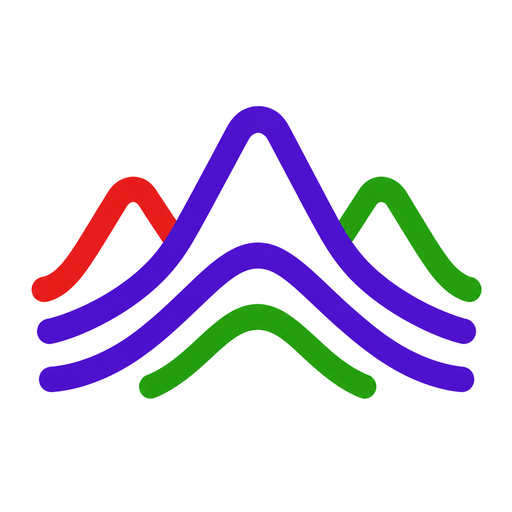

#  DemTools.jl

DemTools.jl is a Julia package for processing digital elevation models. It currently provides Laplacian filtering utilities for smoothing DEMs while controlling the wavelength scale and amplitude reduction of removed terrain roughness.
